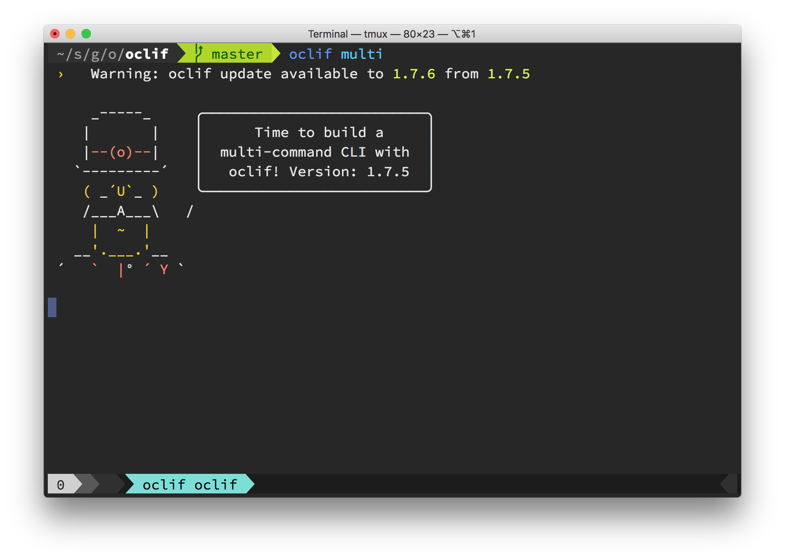

# @oclif/plugin-warn-if-update-available

warns if there is a newer version of CLI released

[](https://npmjs.org/package/@oclif/plugin-warn-if-update-available)
[](https://npmjs.org/package/@oclif/plugin-warn-if-update-available)
[](https://github.com/oclif/plugin-warn-if-update-available/blob/main/package.json)

<!-- toc -->

- [@oclif/plugin-warn-if-update-available](#oclifplugin-warn-if-update-available)
- [What is this?](#what-is-this)
- [How it works](#how-it-works)
- [Installation](#installation)
- [Configuration](#configuration)
- [Environment Variables](#environment-variables)
- [Contributing](#contributing)
<!-- tocstop -->

# What is this?

This plugin shows a warning message if a user is running an out of date CLI.



# How it works

This checks the version against the npm registry asynchronously in a forked process once every 60 days by default (see [Configuration](#configuration) for how to configure this). It then saves a version file to the cache directory that will enable the warning. The upside of this method is that it won't block a user while they're using your CLI—the downside is that it will only display _after_ running a command that fetches the new version.

# Installation

Add the plugin to your project with `yarn add @oclif/plugin-warn-if-update-available`, then add it to the `package.json` of the oclif CLI:

```js
{
  "name": "mycli",
  "version": "0.0.0",
  // ...
  "oclif": {
    "plugins": ["@oclif/plugin-help", "@oclif/plugin-warn-if-update-available"]
  }
}
```

# Configuration

In `package.json`, set `oclif['warn-if-update-available']` to an object with
any of the following configuration properties:

- `timeoutInDays` - Duration between update checks. Defaults to 60.
- `message` - Customize update message.
- `registry` - URL of registry. Defaults to following your .npmrc configuration
- `authorization` - Authorization header value for registries that require auth. Defaults to following your .npmrc configuration
- `frequency` - The frequency that the new version warning should be shown.
- `frequencyUnit` - The unit of time that should be used to calculate the frequency (`days`, `hours`, `minutes`, `seconds`, `milliseconds`). Defaults to `minutes`.

## Example configuration

```json
{
  "oclif": {
    "plugins": ["@oclif/plugin-warn-if-update-available"],
    "warn-if-update-available": {
      "timeoutInDays": 7,
      "message": "<%= config.name %> update available from <%= chalk.greenBright(config.version) %> to <%= chalk.greenBright(latest) %>.",
      "registry": "https://my.example.com/module/registry",
      "authorization": "Basic <SOME READ ONLY AUTH TOKEN>"
    }
  }
}
```

## Notification Frequency

Once a new version has been found, the default behavior is to notify the user on every command execution. You can modify this by setting the `frequency` and `frequencyUnit` options.

**Examples**

Once every 10 minutes.

```json
{
  "oclif": {
    "warn-if-update-available": {
      "frequency": 10
    }
  }
}
```

Once every 6 hours.

```json
{
  "oclif": {
    "warn-if-update-available": {
      "frequency": 6,
      "frequencyUnit": "hours"
    }
  }
}
```

Once a day.

```json
{
  "oclif": {
    "warn-if-update-available": {
      "frequency": 1,
      "frequencyUnit": "days"
    }
  }
}
```

Once every 30 seconds.

```json
{
  "oclif": {
    "warn-if-update-available": {
      "frequency": 30,
      "frequencyUnit": "seconds"
    }
  }
}
```

# Environment Variables

- `<CLI>_SKIP_NEW_VERSION_CHECK`: Skip this version check
- `<CLI>_FORCE_VERSION_CACHE_UPDATE`: Force the version cache to update
- `<CLI>_NEW_VERSION_CHECK_FREQ`: environment variable override for `frequency` setting
- `<CLI>_NEW_VERSION_CHECK_FREQ_UNIT`: environment variable override for `frequencyUnit` setting

# Contributing

See [contributing guide](./CONRTIBUTING.md)
